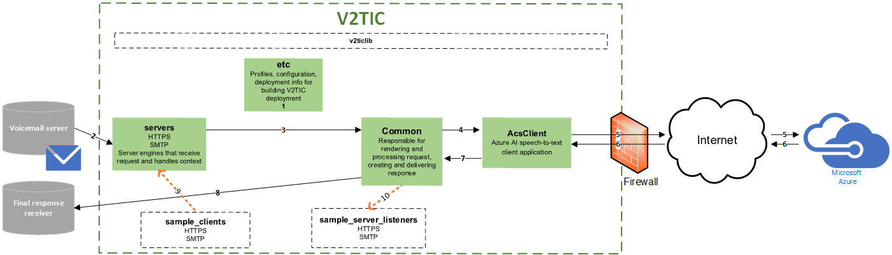

# Architecture

V2TIC is deployable in a container orchestration environment (for example, Kubernetes) to facilitate high availability, load-balancing, and autoscaling.

## Overview of V2TIC request and response

Like for Nuance V2T, V2TIC offers both HTTPS and SMTP protocols. Where V2T solutions connect to the on-premises Nuance Voice-to-Text Conversion Engine, V2TIC acts as an interface between the voicemail server and Microsoft's Cognitive Services Speech Recognition Service.

The diagram below shows the architecture and transcription process for V2TIC.

- The profile, configuration, and deployment information for your deployment are used to build the V2TIC instance. That information informs the V2TIC server, `Common`, and `AcsClient`.
- The V2TIC server for HTTPS or SMTP receives a request and audio for transcription. You can add certificate and key files for this connection. The server also processes the context (such as metadata) for the request.
- The scripts in the `common` folder creates the request using the context from the server and configuration from `etc`.
- `AcsClient` prepares and sends the transcription request to your [Azure AI endpoint](prerequisites.md).
- Azure AI receives the request, completes the transcription, and returns a response.
- `AcsClient` processes and converts the transcription response from Azure AI.
- `common` takes the transcription response and context to build the final response.
- `common` sends the response to the final destination. SMTP deployments can add certificate and key files to authenticate this connection. However, HTTPS deployments cannot, so make sure the end server does not block the port and IP address for HTTPS deployments.
- While running the [sample application](../build-deploy/build-summary.md), the sample client applications send the request from within V2TIC
- During testing, you can change this final connection to the [V2TIC listener](../test-validate/test-validate.md) to view the final response. You can't send to the listener and an outside server at the same time, so you must change the connection back after you finish testing.

[Return to table of contents](../index.md)